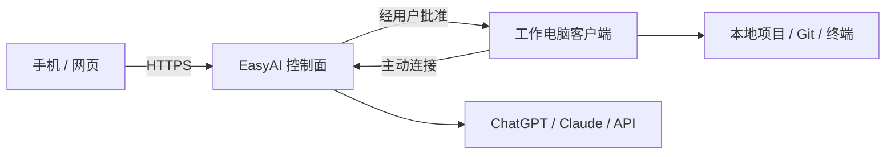

  
  <h1>EasyAI</h1>
  
<strong>电脑在工作，你可以在任何地方。</strong>

  
从电脑、网页或手机指挥 AI 操作自己的开发环境。

**中文** · [English](README_EN.md) · [在线工作台](https://closeai.shop)

> EasyAI 是采用订阅制的闭源商业软件。本仓库是公开发布仓库，只提供产品说明、安装文档和官方二进制安装包，不包含 EasyAI 源代码。

## 下载

| 平台 | 安装包 | 状态 |
| --- | --- | --- |
| Windows 10/11 x64 | [下载安装程序](https://github.com/unfalltable/EasyAI/releases/download/v0.1.0-beta.1/EasyAI-0.1.0-beta.1-Windows-x64.exe) | Beta，暂未代码签名 |
| Linux x64 | [AppImage](https://github.com/unfalltable/EasyAI/releases/download/v0.1.0-beta.1/EasyAI-0.1.0-beta.1-Linux-x86_64.AppImage) / [Debian、Ubuntu](https://github.com/unfalltable/EasyAI/releases/download/v0.1.0-beta.1/EasyAI-0.1.0-beta.1-Linux-amd64.deb) | Beta |
| Android 7+ | [测试 APK](https://github.com/unfalltable/EasyAI/releases/download/v0.1.0-beta.1/EasyAI-0.1.0-beta.1-Android-debug.apk) | 侧载测试版 |
| 浏览器 / PWA | [打开 EasyAI](https://closeai.shop) | 可直接使用 |
| macOS / iPhone / iPad | 准备中 | 等待 Apple 签名与公证 |

所有安装包同时发布 SHA-256 校验文件。也可以从 [EasyAI 官方下载页](https://closeai.shop) 获取。具体步骤见[安装指南](docs/INSTALLATION.md)。

## 使用流程

1. 注册并登录 EasyAI。
2. 订阅基础服务，然后选择 ChatGPT 官方登录、Claude API Key、OpenAI API Key，或申请额外付费的 EasyAI 托管账号。
3. 在工作电脑安装 EasyAI，使用一次性配对码连接设备并选择允许访问的项目目录。
4. 在工作台选择项目、在线电脑、模型账号和模型，然后发送任务。
5. AI 请求写文件、运行命令或执行 Git 操作时，由你确认后才会在工作电脑执行。
6. 工作电脑保持开机在线时，可以从手机、网页或其他电脑继续同一会话。

## 主要能力

- 管理本地项目、文件、终端命令和 Git 操作。
- 支持 ChatGPT 官方授权、Claude、OpenAI API Key 和平台托管账号。
- 用户记忆、项目记忆和会话统一保存在 EasyAI 账号下，切换模型账号后仍可继续。
- 每个 EasyAI 用户使用独立运行容器和数据卷。
- 桌面、网页、PWA 和 Android 共用同一会话。
- 支持多台工作电脑和跨电脑 Git 工作流。

EasyAI 不默认托管完整代码仓库。源码保存在你的工作电脑或自己的 Git 远端；发送给模型服务的上下文受相应模型服务商条款约束。

## 安全说明

- 平台账号、模型账号和设备配对凭证相互独立。
- 文件写入、命令和 Git 操作需要用户批准。
- 同一运行节点上的用户容器可能共享公网出口 IP；需要独立出口时应使用不同网络线路的运行节点。
- 模型可用地区、账号状态和服务规则由对应服务商决定。
- 请勿在公开 Issue 中提交密码、Cookie、API Key、服务器凭证、个人信息或用户代码。

## 反馈与支持

普通问题可以使用 [GitHub Issues](https://github.com/unfalltable/EasyAI/issues)。安全问题请按[安全策略](SECURITY.md)私下报告。

## 许可

EasyAI 为专有商业软件。下载和使用官方客户端代表你同意 [EasyAI 专有商业许可](LICENSE)以及适用的订阅或订单条款。
